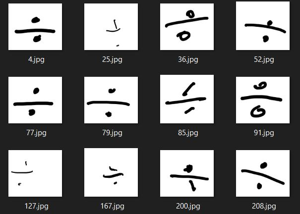

# Math symbol recognition using my own dataset and Resnet-18

Recognizes 0-9 and + - x / = . with Resnet-18.

Techniques like visualizing the weights and confusion matrix are used.

The final accuracy is 97%.

I created my own dataset to train the network, which contains 500 symbols from 3 persons. If you need it to train your network, please contact me.

